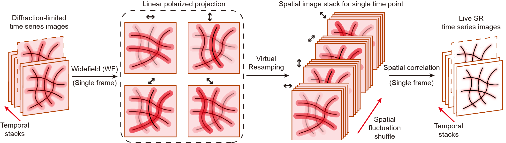

<div align="center">

# SPIFFI

### **S**patial **P**olarization-**I**nduced **F**luorescence **F**luctuation **I**maging

**Single-shot super-resolution and multidimensional fluorescence microscopy**

[](https://www.gnu.org/licenses/gpl-3.0)
[](https://www.mathworks.com/)
[](https://www.biorxiv.org/content/10.64898/2025.12.12.693764v1)

</div>

---

SPIFFI is a MATLAB implementation of **Spatial Polarization-Induced Fluorescence Fluctuation Imaging**, a computational super-resolution technique that exploits spatial fluorescence fluctuations induced by a polarization detector to achieve super-resolution from a **single snapshot**. SPIFFI also enables simultaneous extraction of fluorophore **orientation** (in-plane angle and degree of linear polarization).

This repository accompanies the manuscript:

> **"Spatial Polarization-Induced Fluorescence Fluctuation Imaging (SPIFFI) Enables Single-shot Super-Resolution and Multidimensional Imaging"**  
> Wei Guo, et al. — EPFL  
> *bioRxiv* 2025. DOI: [10.64898/2025.12.12.693764](https://www.biorxiv.org/content/10.64898/2025.12.12.693764v1)

If you use SPIFFI in your research, please cite this work.

---

## Overview

<div align="center">

</div>

Conventional fluorescence fluctuation methods require many frames to accumulate temporal intensity fluctuations. SPIFFI instead uses a **linear polarization filtering strategy in the emission optical path** — which simultaneously captures four polarization channels (0°, 45°, 90°, 135°) in a single exposure, and inherently yields a narrower effective PSF in each channel. These polarization-induced spatial fluctuations serve as the input to autocorrelation analysis, delivering super-resolution from **a single snapshot**.

**Key capabilities:**

- **Single-shot super-resolution** — one raw polarization image → 1.7–2× resolution improvement over widefield
- **Two-stage super-resolution** — combine spatial (SPIFFI) and temporal (SOFI) fluctuations for higher resolution gains
- **Orientation imaging** — simultaneous retrieval of fluorophore dipole angle and degree of linear polarization (DoLP)
- **Drift correction** — built-in sub-pixel drift estimation and correction for time-lapse datasets

---

## Three Reconstruction Modes

| Mode | Script | Input | Output |
|------|--------|-------|--------|
| **Single-shot** | `SPIFFI_main_singleshot.m` | 1 frame × 4 polarization channels | Super-resolved image |
| **Two-stage** | `SPIFFI_main_twostage.m` | N frames × 4 channels | SPIFFI per frame → SOFI → ultra-SR image |
| **Orientation** | `SPIFFI_main_orientation.m` | 1 frame × 4 channels | dipole angle map + DoLP map |

---

## Repository Structure

```
SPIFFI/
├── SPIFFI_main_singleshot.m       # Single-shot reconstruction demo
├── SPIFFI_main_twostage.m         # Two-stage (SPIFFI + SOFI) demo
├── SPIFFI_main_orientation.m      # Orientation imaging demo
├── SPIFFIutils/
│   ├── SPIFFI_functions.m         # Core reconstruction engine
│   ├── PSFcalculation.m           # Scalar diffraction PSF model
│   ├── fourierInterpolation.m     # Fourier-domain upsampling
│   ├── pixelSplit.m               # Virtual resampling
│   ├── plotAngle.m                # Dipole angle & DoLP visualization
│   ├── driftEstimation.m          # Sub-pixel drift estimation
│   ├── driftCorrection.m          # Drift correction
│   ├── rollingBall.m              # Rolling-ball background subtraction
│   ├── readAll.m                  # Multi-frame TIFF loader
│   ├── fire.m                     # Fire colormap
│   └── isolum.m                   # Isoluminant colormap
├── SPIFFIdata/
│   ├── singleshot/                # Demo: microtubules
│   ├── twostage/                  # Demo: 80 nm DNA nanorulers
│   └── orientation/               # Demo: giant unilamellar vesicles (GUVs)
├── Manual.pdf                     # Full user manual
└── LICENSE.txt                    # GNU GPL v3
```

---

## System Requirements

- **MATLAB** R2020b or later
- **Image Processing Toolbox** (required — `deconvlucy`, `imhistmatch`)
- **Parallel Computing Toolbox** (optional — recommended for two-stage mode `parfor` loop)
- **Operating system**: Windows 10/11 (tested)

---

## Quick Start

### 1. Clone or download

```matlab
% In MATLAB, navigate to the SPIFFI folder, then:
addpath(genpath('./SPIFFIutils'))
```

### 2. Run a demo

**Single-shot super-resolution (microtubules):**
```matlab
run SPIFFI_main_singleshot.m
```

**Two-stage super-resolution (80 nm DNA nanorulers):**
```matlab
run SPIFFI_main_twostage.m
```

**Orientation imaging (GUVs):**
```matlab
run SPIFFI_main_orientation.m
```

Each script loads the bundled demo data from `SPIFFIdata/` and displays a comparison figure (widefield vs. SPIFFI).

---


## Demo Results

### Single-shot: microtubules

| Widefield | SPIFFI |
|-----------|--------|
|  |  |

### Two-stage: 80 nm DNA nanorulers (SPIFFI + SOFI)

| SMLM | SPIFFI + SOFI |
|------|---------------|
|  |  |

### Orientation: GUVs — dipole angle and DoLP

| Angle map | DoLP map |
|-----------|----------|
|  |  |

---

## Citation

If SPIFFI contributed to your work, please cite:

```bibtex
@article{guo2025spiffi,
  title   = {Spatial Polarization-Induced Fluorescence Fluctuation Imaging (SPIFFI)
             Enables Single-shot Super-Resolution and Multidimensional Imaging},
  author  = {Guo, Wei and others},
  journal = {bioRxiv},
  year    = {2025},
  doi     = {10.64898/2025.12.12.693764}
}
```

---

## License

SPIFFI is released under the **GNU General Public License v3.0**. See [LICENSE.txt](LICENSE.txt) for details.

---

## Contact

For questions, bug reports, or suggestions, please open a GitHub issue or contact:

**Wei Guo** — EPFL  
wei.guo@epfl.ch
